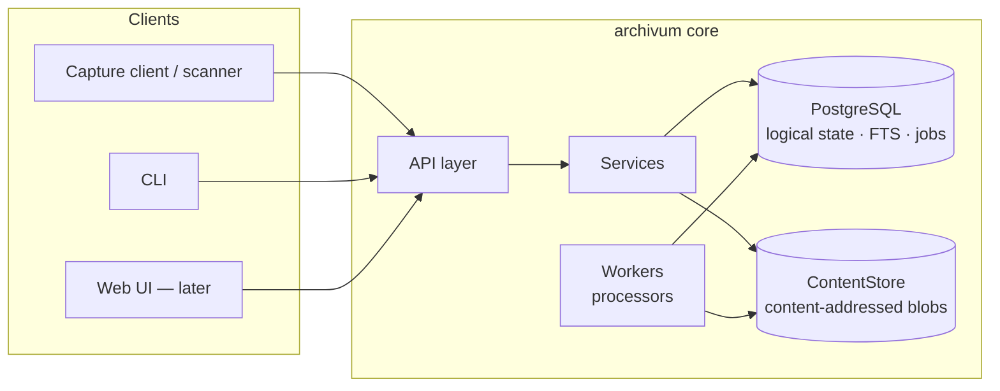

# Architecture overview

Target architecture for archivum. This document describes design intent;
where reality lags it, the roadmap says what exists. Decisions with real
alternatives live in `../adr/`.

## Shape

A modular monolith (ADR-0001): one Python package, one deployable, strict
internal boundaries.

```text
src/archivum/
├── domain/          # entities, invariants, domain events — no IO, no framework imports
├── repository/      # document/folder/version services (use-cases, transactions)
├── content/         # ContentStore interface + implementations
├── metadata/        # schemas, field definitions, values, validation
├── audit/           # append-only audit writer + query
├── identity/        # principals; later authn/authz
├── processing/      # job queue, worker loop, DocumentProcessor interface
├── search/          # indexer (derived state), query
├── api/             # FastAPI routers — the only surface clients see
└── db/              # SQLAlchemy tables, engine, Alembic wiring
```

Boundary rules: `domain/` imports nothing from outer layers; `api/` touches
state only through services, never tables. Modules exist when they have
content — empty scaffolding is not architecture.

## Core principle: identity

A document is a durable logical entity identified by a permanent UUID —
never by filename, folder, path, or current version. Rename, move,
re-metadata, and re-version are state changes *about* the same entity. The
tree is one `entries` table (ADR-0005); content is content-addressed blobs
distinct from document identity (ADR-0003).

## System separation



PostgreSQL serves relational state, full-text search, and the job queue
(ADR-0002). Blob bytes live behind `ContentStore`; the database stores
content references and hashes, never physical paths in API responses.

## Domain model (first iteration)

- **Principal** — actor identity (user | service | system). Minimal from
  V0.1 so audit events always have a real actor (ADR-0004).
- **Entry** — tree node: `id`, `type`, `title`, `parent_id`, `state`.
  Invariants: unique title per parent, no cycles, parent is a folder.
- **Document** — Entry satellite: current-version pointer, document type.
  Invariant: ID survives everything except purge.
- **DocumentVersion** — immutable: number (monotonic per document), blob
  reference, MIME, size, creator, timestamp, change note. History is
  append-only: restore creates a new version referencing the source
  version's blob, and the current pointer always sits at the highest
  number — which is what makes `expected_version` (→ HTTP ETags) a sound
  concurrency token (ADR-0007).
- **Blob** — content identity: SHA-256 (unique), size, storage key. Two
  documents may share one blob.
- **MetadataSchema / MetadataFieldDefinition** — document types as data,
  not code; fields carry type, requiredness, choices, and an extraction
  hint (inert until the intelligence layer).
- **MetadataValue** — typed value + **provenance** (manual | extracted |
  validated | imported), confidence, source detail. Extraction output is a
  suggestion; human verification is the canonicalization boundary.
- **AuditEvent** — append-only, in-transaction (ADR-0004).
- **ProcessingJob** — queued | running | succeeded | failed | dead, with
  attempts, backoff, idempotency key.

## Canonical vs derived state

| State | Class | On loss |
|---|---|---|
| entries, documents, versions, metadata, schemas | canonical | data loss — backed up |
| blobs (bytes + rows) | canonical | data loss; hash-verifiable |
| audit events | canonical | append-only; never rebuilt |
| processing jobs | canonical (operational) | truth about work owed |
| search index | derived | `reindex` rebuilds from canonical |
| OCR/text representations, thumbnails, previews | derived | regenerate (costs time/money, not truth) |
| processor result caches | derived | only cost returns |
| upload temp files, job leases | ephemeral | safe to lose |

Subtlety: extracted metadata is derived **until verified** — after
verification it is canonical, and re-running extraction must never
overwrite it. Provenance records the transition.

## Consistency

Blob-first write ordering (ADR-0003): bytes reach the ContentStore before
the database transaction that references them. The tolerated orphan is a
blob without a row; a row without bytes cannot happen. Jobs and domain
events are enqueued in the same transaction as the state change that
warrants them (outbox pattern, from V0.5).

## Deliberately not here (yet)

Elasticsearch, message brokers, Kubernetes, microservices, a visual
workflow designer, an early frontend. Each absence is intentional at this
scale; each has a named upgrade path if observed need appears.
